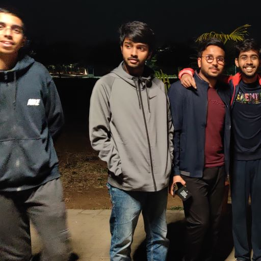
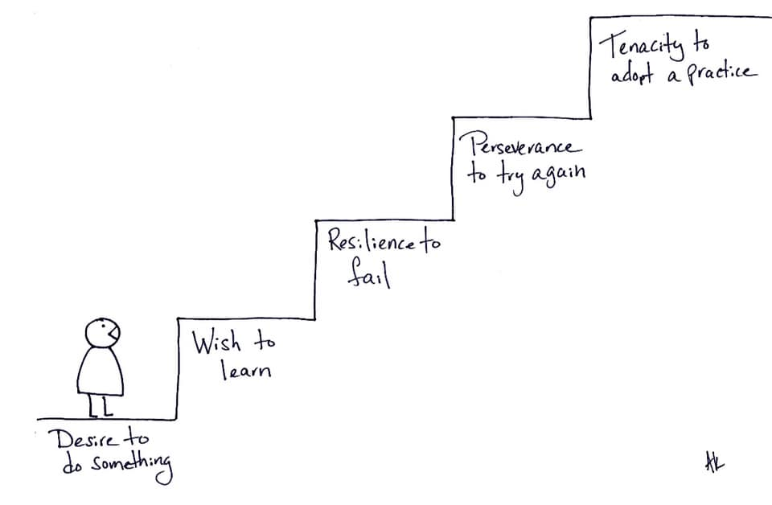

## About Me

I’m a junior undergraduate at IIT Gandhinagar. I’m into developing games, VFX, editing videos, computer graphics, and simulations. I’ve mentioned some of my work below. If you want the source code/ build of any of these you can contact me! (Few of them are available  on my [Github](https://github.com/aniketrajnish))
## Skills

Type | List
-----|-------|--------
Languages | C#, C++, HLSL, GLSL, Python, XML
Tools & Technologies | Unity, OpenGL, Adobe Premiere Pro, Adobe After effects, Photoshop, Blender, Adobe XD, GameMaker Studio 2, MATLAB, Autodesk Inventor
 
## POR
 1. Secretary, [DigiS IIT Gandhinagar](https://www.instagram.com/digis_iitgn/) 
  * Leading a team of over 100 game developers in my college. 
  * Teaching the basics of Unity and Game Development to the freshers since the last two years by organizing regular workshops and meetings.
  * In the past 6 months, DigiS has become the most active club and the biggest Game Development College club amongst all IITs.
  * We've been the leading Indian game development team in several game jams.
  * Organized an AR workshop attended by 300 people from IIT Bombay, IIT Hyderabad & IIT Gandhinagar.
  * Organized [Game Jam 2020 AD](https://itch.io/jam/gamejam-2020-ad) in collaboration with [Amalthea IIT Gandhinagar](https://www.instagram.com/amalthea_iitgn/). 609 people         participated to make 96 games making it the third biggest Indian game jam to be held on itch.
  * Organized [Game Jam 2021 AD](https://itch.io/jam/game-jam-2021-ad-420) which turned out to be even bigger than its previous edition
 2. Techincal coordinator, IIT Gandhinagar
  * Leading a team of 10 people to assist the Technical Secretary to conduct the Technical activities held at IITGN efficiently.
  * Overlooking the functioning of all the technical clubs and events.
 3. Eureka Video Coordinator
  * Led a team of 12 video editors.
  * Made the [Foundation Programme Video](https://youtu.be/SLwEwTwHNhM) of Btech'19, IITGn. 
 4. Founder / Game Developer, Makra
  * Developing scalable games in partnership with some of the biggest hypercasual publishers!

## Games

1. Two Opposites
 * Play [Here](https://makra.itch.io/two-opposites)
 * Made in 7 days for the 2021 Brackeys Game Jam (2nd biggest gamejam on itch with 10k+ participants)
 * Game ranked #22 in the innovation category, #44 in the Game Design category and #71 overall.
 * Programmed every mechanic of the game (mirror movement, multiple camera setup etc.)
 * Made my own 2d lighting system from scratch using raycasts. Repo [here](https://pastebin.com/6biXjsUp).
2. Faster Than Light (Hypercasual)
 * Play [Here](https://play.google.com/store/apps/details?id=com.makra.FasterThanLight)
 * Won the [JAMBOOST](https://gamejam.com/jam/jamboost) game jam hosted by [Chartboost](https://www.linkedin.com/company/chartboost/) and a prize of 1000$
 * Did fairly well in CPI tests.
 * Got 180$ for promotion.
 * Programmed every mechanic & enemy AI of the game.
 * Looked after the lighting and shaders used in the game.
 * Optimized time control mechanics for the mobile platform.
 * Learnt how to optimize indoor lighting on mobile platform
 * Repo [here](https://github.com/aniketrajnish/FasterThanLight_Hypercasual).
3. Faster Than Light (PC)
 * Play [Here](https://makra.itch.io/faster-than-light)
 * Made in 7 days for the 2020 Brackeys Game Jam (3rd biggest gamejam on itch with 9k+ participants)
 * Game ranked #71 in Audio category and #132 overall.
 * Programmed every mechanic & enemy AI of the game.
 * Looked after the lighting and shaders used in the gamne.
 * Implemented bullet time mechanics.
 * Implemented player physics from scratch that would allow the player to move in space independent of the world's timescale. 
4. Are Ya Winning Son?
 * Play [Here](https://makra.itch.io/are-ya-winning-son)
 * Made in 2 days for the 2020 GMTK Game Jam (Biggest gamejam on itch with 19k+ participants)
 * Game's presentation ranked #221.
 * Learnt to program small games in Unity in a limited amount of time.
5. 2048 Jelly
 * Play [Here](https://play.google.com/store/apps/details?id=com.Makra.J2048)
 * Entire game was made by me using Unity.
 * Learnt to optimize realtime lighting for mobile devices.
 * Learnt to optimize post processing for mobile devices.
6. AFPS
 * Leading a team of 25 individuals working on an Indian themed multiplayer game.
 * Watch the [teaser](https://youtu.be/pLk2W575Z78)
7. Covid 19 Survival Royale
 * An FPS-shooter pandemic simulator I made.
 * Got the first prize in a game jam hosted by my college.
 * Play [Here](https://drive.google.com/a/iitgn.ac.in/file/d/1RTDkU-kCBgqKmpHz13iJLWdAk9BMoVwX/view?usp=drivesdk)
 * Made the entire game as a starter project in Unity.
 * Learnt gun mechanics, enemy AI programming and crowd simulation.
8. Return To Monke
 * Currently under development under a testing deal by [Kwalee](https://www.kwalee.com/)
 * [Prototype](https://gamejolt.com/games/return2monke/640579) submitted to the IGDAF game jam.
 * Programmed the entire mechanic of the game in Unity.
 * Looked after the lighting and shaders used in the gamne.
9. Fertilize.io
 * Play [Here](https://play.google.com/store/apps/details?id=com.makra.fert) 
 * Made in 2-3 days (I was stepping my shoes into game development that time) to be displayed in some Senate Meeting by our current club secretary. This game also includes a        free open source database that I used to create an online leaderboard completely free (without paying google Play’s 25$ cost)
 * Made this game entirely in Unity as a starter 2D project.
10. &nbsp;Banana Warrior
 * Play [Here](https://play.google.com/store/apps/details?id=com.makra.BananaWarrior) 
 * Watch the devlog [here](https://youtu.be/9eCWAQxkuiI)
 * Solo developed this game entirely in Unity for the college community to compete in!
11. &nbsp;Doge To The Moon
 * Play [Here](https://gamejolt.com/games/doge2themoon/636263) 
 * Made for the [Opera GX GameJam](https://gamejolt.com/c/gamemaker/ogxgj)
 * Watch the devlog [here](https://youtu.be/bzKPQ8AuJ9Q)
 * Wrote the mechanics for this game to learn GMS2.
 * Repo [here](https://github.com/aniketrajnish/operagx-gamejam-speedrun)
12. &nbsp;Toilet Spinner
 * Play [Here](https://play.google.com/store/apps/details?id=com.makra.ToiletSpinner) 
 * Watch the devlog [here](https://youtu.be/HeaLfiw1AVU)
 * Solo developed this game in Unity for the college community to compete in!
13. &nbsp;Obamium Maker
 * Make your own version of Obamium!
 * Try [Here](https://play.google.com/store/apps/details?id=com.makra.ObamiumMaker) 
 * Watch the devlog [here](https://www.youtube.com/watch?v=I6uJLIQS71s)
 * [Source Code](https://github.com/aniketrajnish/obamium-maker)
14. &nbsp;Chrome Dino Replica
 * Play [here](https://share.catrob.at/app/project/4babb95a-8629-11eb-a92d-005056a36f47)
 * Made this to learn Pocket Code - A visual scripting based game development app on android.
 
*Find more games developed by me [here](https://play.google.com/store/apps/developer?id=DigiS+IIT+Gandhinagar), [here](https://makra.itch.io/), and [here](https://play.google.com/store/apps/dev?id=7545721879938982945)*

## Crazylabs Partnership (Ongoing)

* The following game prototypes are being developed in partnership with [CrazyLabs](https://www.crazylabs.com/)- 

1. [Shoot The Numbers](https://youtu.be/OnMOxLZIVHE) 
   * Optimized multiple navmesh agents for mobile devices.
   * Wrote a shader that supports both transparency and interpolation between two colours.
   * Wrote swerve mechanics trending in hypercasual games these days.
   * Wrote mechanics for algebraic gates trending in hypercasual games these days.
2. [Body Adjustment ASMR](https://youtu.be/lCib1Dg591A)
   * Wrote mesh deformation and reformation algorithm.
   * Wrote a mesh outline algorithm that's performant on mobile devices.
3. [Hoof Cleaning ASMR](https://youtu.be/PZkQhBOjrHU)
   * Wrote texture masking algorithm to erase / paint textures over meshes.
4. [Jelly Cleaner ASMR](https://youtu.be/FnhNXtHPPoE)
   * Wrote jelly physics algorithms that's performant over mobile devices using spring joints.
5. [Human Canon](https://youtu.be/XJnFSqy4siI)
   * Worte ragdoll crowd control mechanics.
   * Wrote canon projectile mechanics.
   * Wrote a low poly water shader.
6. [Dodge Master](https://youtu.be/6OCS70rkZJk)
   * Wrote time control mechnaics.
   * Implemented mesh deformation and reformation algorithm from Body Adjustment ASMR.

The ideation and developement of these games is done by me. Marketing and publishing side of things is looked over by CrazyLabs. The source code and the build for the games can't be shared publicly as this comes under NDA.

## Project Holly

 * This project aims at unifying games and movies in ways never done before
 * A platform for completely interactive movies
 * The movies will proceed in the way you want them to
 * Your choices form one of the many perspectives
 * You take control of the protagonist
 * Everything is streamed online so you only use your data for what you want
 * Try the demo [here](https://play.google.com/store/apps/details?id=com.makra.Holly)
 * Developed an asset that allows one to stream a video in small chunks accroding to his choices.

## Computer Graphics

 * [Raymarching Engine](https://github.com/aniketrajnish/Raymarching-Engine) 
   Currently writing a raymarching engine in Unity. This technique allows rendering complex geometry like fractals, n-dimensional objects, volumetric clouds, etc. using very little computation costs by just comping up with a distance function for the surface that we want to render.
 * [Teserract Unity Implementation](https://github.com/aniketrajnish/4D-tesseract-unity-implementation) 
   A rotating hypercube implemented in unity using mesh generation and GL library. Underlying maths includes rotation & projection of coordinates using rotation & projection matrices.
 * [Rendering a 4D Hypercube](https://editor.p5js.org/aniketrajnish/sketches/wJVjV9OAY) 
   Demonstration of a 3D section of a rotating 4D Hypercube (with hardcoded coordinates) by using rotation and projection matrices as a part of project of the MA202 course at      IITGN. Currently working upon ray marching techinques to expand this technique to render complete 4D worlds in Unity.
 * [3D Render using Gaussian elimination](https://editor.p5js.org/aniketrajnish/sketches/S-KwEmoSm) 
   Mathematically modeled a 3D rendering technique that uses numerical methods to calculate the intersection of planes and render 3D objects as a part of a project of the MA202      course at IITGN. Currently planning to apply the underlying methodology to the 4th dimension and develop a 4D rendering engine that uses these numerical methods instead of      the traditional approach of using ray marching/ projection and rotation matrices.
 * [Specular lighting in OpenGL](https://github.com/aniketrajnish/specular-lighting-opengl) 
   Implemented specular ligting in OpenGL by following tutorials from [Michael Grieco](https://michaelg29.github.io/)
 * [Raycast 3D renderer](https://scratch.mit.edu/projects/510603211/) 
   A 3D renderer I implemented in scratch that uses the traditional concept of raycasting used in games like VCOP2 and Wolfenstein 3D.
 * [Non Euclidean World in Unity](https://youtu.be/wi1RoQJWHbk) 
   Optical illusion made by using multiple intersecting single-sided planes instead of a 3d mesh.

## Simulations
 
 * [Realtime Jelly Simulation in Unity](https://youtu.be/fMwoglpPgFk) 
   Wrote an optimized jelly physics algorithm that works in realtime on different platforms using spring joints between armatures! 
 
 * [Realtime Slime Simulation in Unity](https://youtu.be/a__DdXiYQ-U) 
   Similar approach as jelly simulation used but with more spring density to make the mesh look more viscous.
 * [Fire Simulation in Blender](https://youtu.be/_QH19dipOxY)  
   Done with the help of one of my club members.
   
 * [Putting my simulations to work - 2048 Jelly](https://youtu.be/9tfnqnrit_0)  
   This game uses real-time Jelly-Physics that I mentioned above.  

## Higher Dimension 
 
 * [Raymarching Engine](https://youtu.be/a__DdXiYQ-U) 
   Currently writing a raymarching engine in Unity primariy to come up with a set of tools that would allow people to visualize and create higher dimensional worlds like they do in a 3D modelling software like Maya, 3ds, blender etc.
 * [Rendering a 4D Hypercube](https://github.com/aniketrajnish/4d-rendering-ma202-project)  
   My first project on higher dimension visualisation was demonstration of a 3D section of a rotating 4D Hypercube by using rotation and projection matrices
   
 * [Teserract Unity Implementationy](https://github.com/aniketrajnish/4D-tesseract-unity-implementation)  
   A rotating hypercube implemented in unity using mesh generation and GL library.
   
 * [4D Hypercube NFT Marketplace](https://opensea.io/collection/4d-hypercubes) 
   Created a NFT collection of 4D hypercubes rotating along different axes.  

## VFX & Edits
  
 * [Messing around with shaders - GameJam 2020 AD Trailer](https://youtu.be/4zfHbw6GRes)  
   I made this trailer using a shader that I wrote for Unity. This shader uses one-sided features of multiple planes to give a non-euclidean look (currently working on a    puzzle-game based project that uses this!).  Also, I wrote a shader to replicate the look of HDRP reflective materials using Unity's built-in render pipeline and a reflection    probe. Added the materials based on these shaders to the mascots and the jar!
  
 * [Messing around with VFX Graphs - GameJam 2020 AD Theme Reveal Video](https://youtu.be/kPlAOdrKgbw)  
   I had to make a theme reveal for a game jam that my college is hosting. So I decided to utilize this opportunity and learn VFX graphs in Unity. VFX graphs help to simulate over a million particles in real-time using the parallel processing power of GPU unlike the paticle system which works over the CPU and is much slower. Everything that you see in this video is made out of '2020', which was the theme for the JAM itself.
  
 * [Messing around with Particle Systems - Psychedelic Edit](https://youtu.be/ofWcNlWYwnI)  
   Because Dani said 'You can make anything using Unity's particle system'
  
 * [Recreated Coldplay's Up&Up Music Video](https://youtu.be/gy9gc2orpCY)  
   Rendered using Motion Tracking in Blender and After Effects
   
 * [Recreated Interstellar's Black Hole](https://youtu.be/pGvQrE8Plsc)  
   With 0 budget, blender and the help of my senior.  
   *Fun Fact: Most of the trailers and intro videos for societies, events & fests of IITGn are made on game Engines instead of dedicated editing softwares as it is done by us.*

> "If development took 69 lines of code, then fixing the bugs would take 420 more" - William Shakespeare

## Misc
 * Love playing [games](https://www.youtube.com/playlist?list=PLQi4IKEYBPHWsrbZpf24op7APre8zRwzH) as much as I love making them.
 * It's evident but yes I have a small [YouTube Channel](https://www.youtube.com/channel/UCK8irXTX_8mbz-ytFiZ96bA)
 * Did [something](https://youtu.be/Jv5gQzI1xhk) in Unity people thought was not possible XD
 * [Made a 2d scene look 3d with lighting](https://youtu.be/lTMu77EimPk)
 * Came across this beautiful [bug](https://youtu.be/7KExwAeeuqs)
 * [Remade Dani's Flash Games in Unity](https://www.youtube.com/playlist?list=PLQi4IKEYBPHUisVkBGx31KaW5VgUB64z2)
 * A [random shitpost game](https://play.google.com/store/apps/details?id=com.makra.KillTheStickMan&hl=en&gl=US) that I made in 15 minutes blew up on play store and is being downloaded by thousands of users everyday.
 * My first unity project was a [FAP Simulator](https://drive.google.com/file/d/14pdEJFl5diFXQK_w2OoOAnTkQGs10Eab/vi) XD
 * I have over 10k karma on [Reddit](https://www.reddit.com/user/aniketrajnish/?sort=top).

